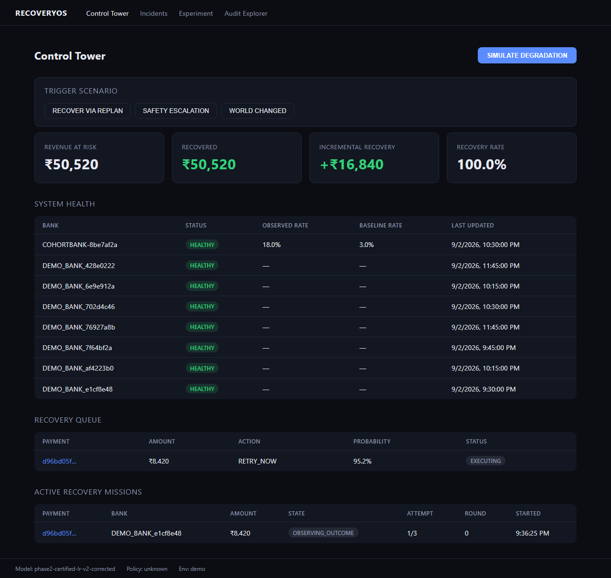
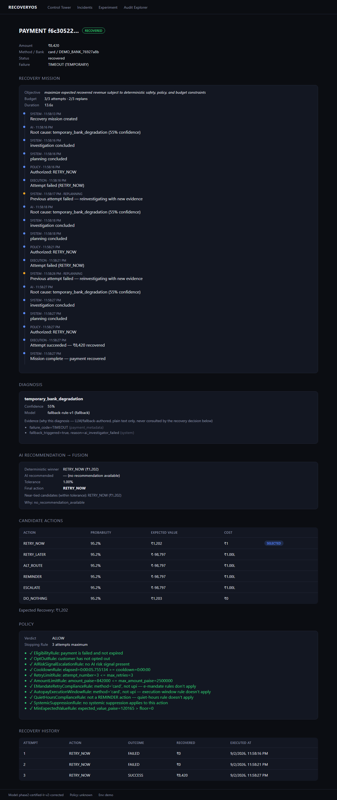
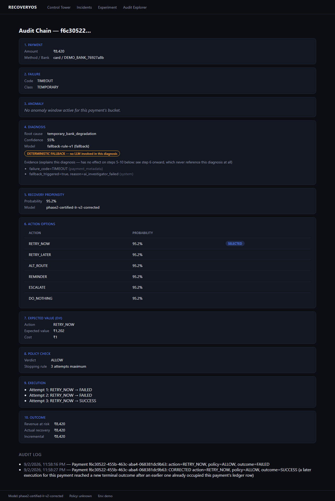
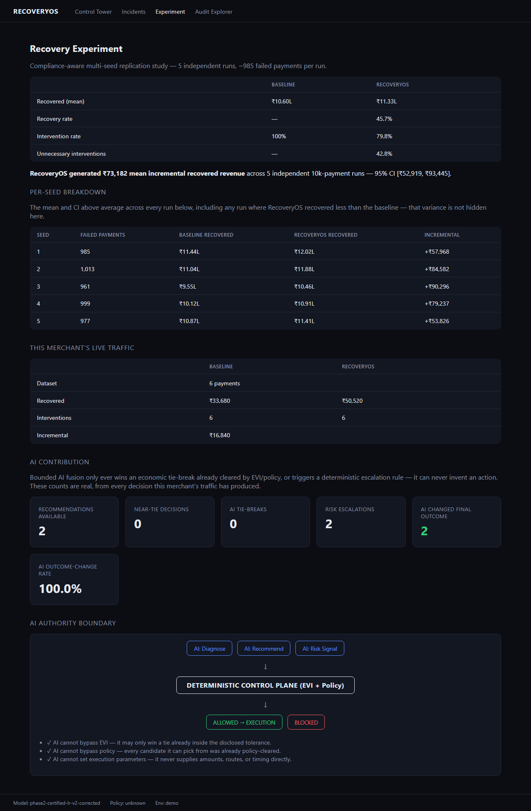
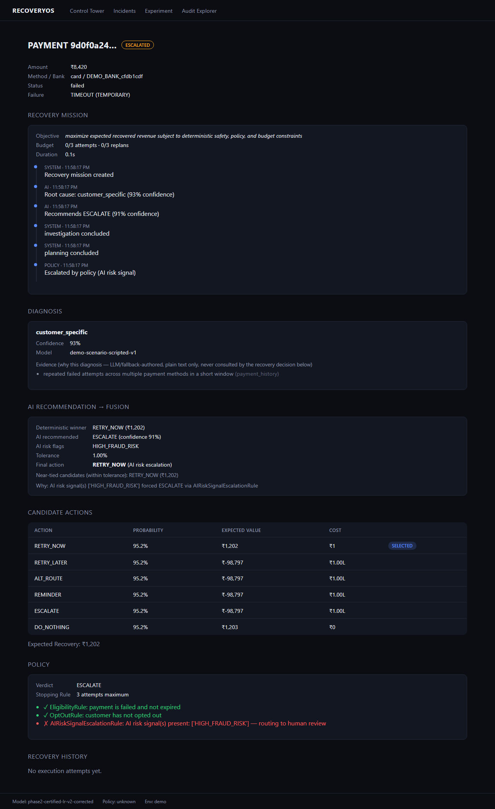

# RecoveryOS

### The Autonomous Recovery Layer for Failed Payments

[](https://github.com/Ujjwaljain16/RecoveryOS/actions/workflows/ci.yml)


A failed payment isn't the end of the transaction. It's the beginning of a recovery mission.

RecoveryOS turns `payment.failed` into a closed loop — investigate, decide, act, observe, replan —
instead of a fixed retry schedule and a shrug.

> **AI investigates and recommends. Deterministic systems authorize. RecoveryOS executes.**

That's the whole architecture in one line — the architectural boundary that makes this auditable
and safety-constrained: the AI never moves money on its own, under any circumstance. [§5](#5-ai-that-recommends--never-authorizes)
shows exactly how.

---

## The result

# +₹73,181.78

**mean incremental recovered revenue**, vs. a compliance-aware baseline, across 5 independent
10,000-payment simulations.

| | |
|---|---|
| 95% confidence interval | **+₹52,918.53 to +₹93,445.04** |
| Seeds with a positive result | **5 / 5** |
| Seeds where RecoveryOS's recovered payments are a strict superset of the baseline's | **5 / 5** |

**This is whole-system lift, not AI-attributed lift.** The deterministic propensity/EVI/policy
engine is doing most of that work, and it's completely AI-blind by construction. The AI layer
itself is mechanism-proven and safety-proven end to end, but its real-model behavioral evidence is
still small — 4 payments, 2 real Gemini recommendations, 0 observed tie-breaks or escalations,
gated by free-tier quota, not hidden. Full breakdown: [§17](#17-honest-limitations).



*The Control Tower, live — not a mock. Every number on this screen is read from the same database
the recovery engine writes to.*

---

## Quick demo

```bash
./demo.sh
```

Brings up the full stack, seeds a merchant, and prints the exact command to trigger a live
`recover_via_replan` mission — fails once, replans, recovers, all in real time on the dashboard.
Full setup, manual steps, and every scenario: [§13](#13-run-the-demo).

---

## Table of contents

1. [What is RecoveryOS?](#1-what-is-recoveryos)
2. [The Product Experience](#2-the-product-experience)
3. [How It Works](#3-how-it-works)
4. [Architecture](#4-architecture)
5. [AI That Recommends — Never Authorizes](#5-ai-that-recommends--never-authorizes)
6. [The AI Investigator](#6-the-ai-investigator)
7. [The Bounded Recovery Recommendation](#7-the-bounded-recovery-recommendation)
8. [Deterministic Safety](#8-deterministic-safety)
9. [Does RecoveryOS Actually Recover More Revenue?](#9-does-recoveryos-actually-recover-more-revenue)
10. [Fairness & Experiment Design](#10-fairness--experiment-design)
11. [Reliability, Security & Auditability](#11-reliability-security--auditability)
12. [Testing](#12-testing)
13. [Run the Demo](#13-run-the-demo)
14. [Reproducing the Evaluation](#14-reproducing-the-evaluation)
15. [Repository Map](#15-repository-map)
16. [Design Decisions](#16-design-decisions)
17. [Honest Limitations](#17-honest-limitations)
18. [Build Challenges](#18-build-challenges)
19. [Why RecoveryOS Is Different](#19-why-recoveryos-is-different)

---

## 1. What is RecoveryOS?

Most payment-recovery systems do one thing:

```text
payment.failed → retry → retry → give up
```

RecoveryOS does this instead:

```text
payment.failed
  → understand WHY it failed
  → evaluate WHAT is allowed and worth doing
  → choose the best recovery strategy
  → execute it safely
  → observe the outcome
  → replan if it didn't work
  → recover / escalate / stop
```

A failed payment isn't a dead end — it's revenue that might still be recoverable, if the system
asks the right question. Not *"should we retry?"* but:

> **"Given everything we know right now, what is the safest, highest-value recovery action?"**

A UPI payment that failed because the bank's rails are briefly degraded should probably be retried
later, automatically. A payment on a customer who already opted out should never be touched again,
no matter how valuable it is. A payment that looks like it might involve fraud should go to a
human, not get retried at all. Getting this right, payment by payment, is what a merchant is
actually paying for — not a fixed retry schedule.

RecoveryOS is **not** a generic payment-retry service, an LLM chatbot, an "AI wrapper" around
Razorpay, a static rules engine, or a dashboard pretending to be autonomous. It's a recovery
orchestration system with a hard separation of roles:

> **AI = intelligence. Deterministic engine = authority. Execution layer = capability.**

---

## 2. The Product Experience

The dashboard (`apps/dashboard/`, Next.js 14 + TypeScript, plain CSS, no UI framework) has five
real screens.

### Control Tower — `/`
The merchant's overview: revenue at risk, revenue recovered, incremental recovery, recovery rate,
a bank-health grid, the live recovery queue, and active Recovery Missions in flight.

### Payment Detail — `/payments/{id}`
The full story of one payment: its Recovery Mission's live event timeline, the diagnosis and its
evidence, the AI recommendation and how it was (or wasn't) fused into the final decision, all six
scored candidate actions, the policy verdict and rule trace, and recovery history.



*A real, live-triggered `recover_via_replan` mission — not scripted. Attempt 1 failed, the closed
loop reinvestigated and retried, attempt 2 also failed, it reinvestigated again, and attempt 3
recovered the payment. Every timestamp, root-cause line, and policy rule check is the actual
decision trace for this one payment.*

### Audit Explorer — `/audit` → `/audit/{payment_id}`
A 10-step reconstructible decision chain — payment → failure → anomaly → diagnosis → propensity →
action options → EVI → policy check → execution → outcome — plus the raw audit log. Built for the
question a skeptical evaluator actually asks: *prove it, don't just tell me.*



*The same payment as above, replayed step by step. Note the "DETERMINISTIC FALLBACK — no LLM
involved in this diagnosis" badge — the real Gemini call hit its free-tier quota for this
diagnosis, and the system fell back cleanly rather than guessing or blocking.*

### Experiments — `/experiments`
The benchmark this README leads with, live: the 5-seed replication study, per-seed breakdowns with
confidence intervals, this merchant's own live-traffic comparison, and the AI Contribution panel.



*The live page, not a mock — "RecoveryOS generated ₹73,182 mean incremental recovered revenue …
95% CI [₹52,919, ₹93,445]" is the exact same
[`multi_seed_compliance_aware_aggregate.json`](tests/evaluation/artifacts/multi_seed_compliance_aware_aggregate.json)
this README's own headline number is sourced from.*

### Incidents — `/incidents`
Active bank-level anomalies (degraded success rates by bank), independent of any one payment — the
systemic-risk view.

There is no separate "missions" page — a mission's state and full event timeline are shown inline
on its payment's detail page, since a mission always belongs to exactly one payment.

---

## 3. How It Works

```text
Razorpay payment.failed
        ↓
   AI Investigator
   (reasons over real evidence, gathers more if needed)
        ↓
  Recovery Recommendation
  (one bounded action, advisory only)
        ↓
┌─────────────────────────┐
│   Deterministic Guard    │
│  Policy · EVI · Risk ·   │
│  Propensity · Compliance │
└────────────┬─────────────┘
             ↓
       Execute safely
       (idempotent, provider adapter)
             ↓
       Observe outcome
             ↓
    Reinvestigate / Replan
             ↺
```

The AI proposes. The deterministic guard decides what's actually allowed. Execution only ever
happens once something has independently cleared that guard.

Every failed payment gets a **Recovery Mission** — a persisted, code-owned state machine
(`services/recovery_engine/mission.py`), not a stateless retry loop:

```text
OBSERVED → INVESTIGATING → PLANNING → AWAITING_AUTHORIZATION → EXECUTING → OBSERVING_OUTCOME
                                                                                  │
                                     ┌───────────── RECOVERED / ESCALATED / TERMINATED (terminal)
                                     └───────────── INVESTIGATING  ← the closed loop
```

`TERMINATED` is also reachable directly from `INVESTIGATING`/`PLANNING` — a mission can be stopped
before it ever executes anything. The loop back to `INVESTIGATING` is what makes this a *mission*
and not a retry timer: a deferred `RETRY_LATER` window elapsing, or a failed attempt with budget
remaining, both re-open investigation for a genuinely fresh round — new evidence, a new
recommendation, potentially a different decision.
`tests/integration/test_replan_produces_different_recommendation.py` proves this causally: two
rounds, two different AI recommendations, two different final decisions for the same payment.

What makes this a mission, concretely:

- **Persisted, not in-memory.** State lives in `recovery_missions`, survives a process restart.
- **Row-locked, CAS-style transitions.** `transition_mission_async`/`_sync` lock the mission row
  `FOR UPDATE` and validate against the row's real current state before writing — two workers
  racing on the same mission can't both win.
- **Idempotent execution.** Every attempt carries
  `idempotency_key = recovery:{payment_id}:{action_type}:{attempt_number}` plus a Postgres
  advisory lock — a duplicate webhook or a re-delivered job can't double-execute.
- **Scheduled reevaluation, not a fixed timer.** A deferred retry or a failed attempt with budget
  left schedules a real future reevaluation (`scheduled_reevaluations`), picked up by a poller
  with real crash/lease-reclaim handling — see [§11](#11-reliability-security--auditability).

---

## 4. Architecture

```text
                    Razorpay webhook / POST /v1/events
                              ↓
                    services/pipeline/consumer.py
                    (creates/advances a Recovery Mission)
                              ↓
              ┌───────────────────────────────────┐
              │ AI Investigator                    │
              │ services/diagnosis_engine/         │
              │ investigator.py                    │
              │ — hypothesize → gather evidence →  │
              │   revise → bounded recommendation   │
              └───────────────┬─────────────────────┘
                              ↓
                   RecoveryRecommendation
        (services/diagnosis_engine/schemas.py — advisory only)
                              ↓
              ┌───────────────────────────────────┐
              │ Deterministic Authority Layer       │
              │                                     │
              │ Propensity   services/recovery_     │
              │              engine/propensity.py   │
              │ EVI          services/recovery_     │
              │              engine/evi.py           │
              │ Policy (12   services/policy_       │
              │  rules)      engine/rules.py         │
              │ Fusion       services/recovery_      │
              │              engine/orchestrator.py  │
              │              (_apply_ai_fusion)       │
              └───────────────┬─────────────────────┘
                              ↓
                   policy_decisions + decision_fusion_trace
                              ↓
              ┌───────────────────────────────────┐
              │ Execution Worker                    │
              │ workers/execution_worker.py         │
              │ — idempotent, advisory-locked        │
              │ Provider adapters:                   │
              │   integrations/razorpay/adapter.py   │
              └───────────────┬─────────────────────┘
                              ↓
                          Outcome
                              ↓
              workers/retry_scheduler.py — observe, replan
                              ↺ back to INVESTIGATING
```

| Component | Path |
|---|---|
| Mission state machine | `services/recovery_engine/mission.py` |
| Pipeline consumer (event → mission → diagnosis → decision) | `services/pipeline/consumer.py` |
| AI investigator | `services/diagnosis_engine/investigator.py` |
| LLM client (Gemini) | `services/diagnosis_engine/llm_client.py`, `llm_diagnoser.py` |
| Read-only evidence tools | `services/diagnosis_engine/tools.py` |
| Recommendation schema | `services/diagnosis_engine/schemas.py` |
| Deterministic fusion | `services/recovery_engine/orchestrator.py` |
| Tie-break math | `services/recovery_engine/ai_fusion.py` |
| Policy engine (12 rules) | `services/policy_engine/rules.py`, `evaluate.py` |
| EVI | `services/recovery_engine/evi.py` |
| Propensity model | `services/recovery_engine/propensity.py`, `models/recovery/` |
| Next-best-action (pure argmax) | `services/recovery_engine/next_best_action.py` |
| Execution worker | `workers/execution_worker.py` |
| Retry / reevaluation scheduler | `workers/retry_scheduler.py`, `services/recovery_engine/scheduling.py` |
| Razorpay adapter | `integrations/razorpay/adapter.py` |
| API | `apps/api/routers/` |
| Dashboard | `apps/dashboard/` |
| Simulator (synthetic evaluation environment) | `simulator/` |
| Evaluation harness | `tests/evaluation/` |

Every claim below points back to one of these files — architecture → code, not just diagram →
prose.

---

## 5. AI That Recommends — Never Authorizes

**The AI investigator can:**
reason over real, structured recovery evidence · gather additional read-only evidence
mid-investigation · produce one bounded `RecoveryRecommendation` from the closed set the
deterministic engine already scores · attach a confidence score, closed-set risk flags, and a
rationale.

**The AI cannot:**
invent an action outside the 6-value enum · bypass policy or the EVI floor · authorize a candidate
the policy engine has independently rejected · choose the amount, IDs, provider parameters, or
idempotency key · move money directly, under any circumstance.

The authority hierarchy, exactly as implemented (`services/recovery_engine/orchestrator.py`,
`_apply_ai_fusion`; precedence documented in `docs/TRD.md` §3.5):

```text
1. Hard safety / regulatory constraints   (EMandateRetryComplianceRule,
                                            AutopayExecutionWindowRule,
                                            QuietHoursComplianceRule)
2. Deterministic policy constraints       (EligibilityRule, OptOutRule,
                                            CooldownRule, RetryLimitRule,
                                            AmountLimitRule, MoneyExposureLimitRule)
3. AI-derived safety signal, interpreted
   BY a deterministic rule (not the AI)   (AIRiskSignalEscalationRule)
4. EVI eligibility                        (pure argmax + floor — always AI-blind)
5. AI tie-break among eligible near-ties  (services/recovery_engine/ai_fusion.py)
6. AI evidence / rationale                (informational only)
```

> **AI may influence a decision only where deterministic systems have already established that
> the action is permissible.** It never creates permission — it can only resolve ambiguity inside
> permission the deterministic layer already granted.



*Row 3 of the hierarchy above, made concrete: the deterministic engine's own winner was
`RETRY_NOW` (₹1,202 expected value), the AI recommended `ESCALATE` with a `HIGH_FRAUD_RISK` flag,
and the policy rule trace shows exactly which deterministic rule (`AIRiskSignalEscalationRule`)
read that signal and overrode the decision — the AI flagged it, a rule decided.*

---

## 6. The AI Investigator

The investigator isn't handed `failure_code = "TIMEOUT"` and asked to guess. It runs a real,
bounded, tool-calling loop (`services/diagnosis_engine/investigator.py`):

```text
hypothesize → select a tool by expected uncertainty reduction
            → call it → update hypotheses
            → (repeat, up to 2 rounds)
            → finalize: root cause + bounded RecoveryRecommendation
```

Six real, read-only evidence tools (`services/diagnosis_engine/tools.py`, `TOOL_REGISTRY`):
recent payment history, past recovery attempts and outcomes for this customer, this bank+method's
current failure rate vs. its own baseline, recently detected anomaly windows, prior attempts on
*this* payment, and prior policy decisions on *this* payment.

The model only ever chooses *which* tool to run — every tool's arguments are derived server-side
from the payment context, not supplied by the LLM. This closes a real failure mode found in
testing: the model choosing the right tool but getting its arguments wrong.

Every LLM response is schema-validated on the way in; a malformed response, a timeout, or a
network failure all fail the *entire* investigation closed — the caller falls back to a
deterministic rule-based diagnosis, never a half-trusted AI result.

---

## 7. The Bounded Recovery Recommendation

The only shape a recommendation is ever produced in (`services/diagnosis_engine/schemas.py`):

```python
class RecoveryRecommendation(BaseModel):
    model_config = ConfigDict(extra="forbid")          # unknown fields rejected outright

    recommended_action: RecommendedAction               # closed 6-value enum:
                                                          # RETRY_NOW | RETRY_LATER | ALT_ROUTE |
                                                          # REMINDER | ESCALATE | DO_NOTHING
    recommended_delay_minutes: int                       # advisory only — real scheduling stays
                                                          # in services/recovery_engine/timing.py
    confidence: float                                    # capped at the guard-adjusted diagnosis
                                                          # confidence, never trusted at face value
    risk_flags: list[RiskFlag]                            # closed 5-value enum, max 5
    recovery_rationale: str                               # max 500 chars, for the audit trail
```

There's no `amount`, `order_id`, `provider`, or `idempotency_key` field on this model — those are
100% server-derived downstream, regardless of what the LLM says. A smuggled extra field is
rejected by Pydantic before it ever reaches application code.

Persisted to `recovery_recommendations` (migration `0021`) — a real, queryable audit row, not a
transient in-memory value.

---

## 8. Deterministic Safety

- **Policy** (`services/policy_engine/rules.py`) — 12 pure rules, short-circuiting on first
  BLOCK/ESCALATE, zero I/O, zero reference to diagnosis/confidence/AI anywhere in the original 10.
- **EVI** (`services/recovery_engine/evi.py`) — expected value = P(recover) × amount − cost −
  friction − risk penalty. An action needs positive expected value to be eligible at all.
- **Propensity** (`services/recovery_engine/propensity.py`) — the certified production model
  (logistic regression — see [§9](#9-does-recoveryos-actually-recover-more-revenue)) estimates
  P(recover); this feeds EVI and is completely AI-blind.
- **Risk / compliance.** `AIRiskSignalEscalationRule` is the *only* rule that reads anything
  AI-derived, and even then only a closed-set `risk_flags` frozenset — never free text. Any flag
  forces `ESCALATE`, unconditionally, bypassing the EVI floor. The AI never decides `ESCALATE` —
  the rule does.
- **Money exposure.** `MoneyExposureLimitRule` bounds cumulative outstanding attempts against the
  mission's own exposure cap — a second real money-moving attempt can't be authorized while a
  prior one is still genuinely outstanding.
- **Fusion** (`_apply_ai_fusion`) — the only other place AI can change the outcome: a tie-break,
  and only when the deterministic verdict is already `ALLOW`, the recommendation's confidence
  clears a pre-committed floor (0.5, fixed before any measurement), the action is within a fixed
  1% EVI tolerance of the deterministic winner, and that exact candidate independently re-clears
  policy on its own re-evaluation. A near-tied candidate the policy engine has rejected is never
  selected, even if the AI recommends it — a stale recommendation from an earlier round is
  rejected the same way.

Every fusion decision writes one `decision_fusion_trace` row — visible at
`GET /v1/audit/{payment_id}` and the Payment Detail page, so any single decision is independently
reconstructible.

`ai_recommendation_fusion_enabled` defaults to `false` in code — it ships dark; only the dev
`.env` opts in.

---

## 9. Does RecoveryOS Actually Recover More Revenue?

**Methodology, in one sentence:** five independent 10,000-payment seeds, each processed by the
identical live pipeline, compared against a **compliance-aware baseline** — a comparator that runs
the exact same `services.policy_engine.evaluate()` compliance chain RecoveryOS itself obeys, so the
comparison isolates decision quality, not "RecoveryOS obeys rules the baseline never checked."

| Metric | RecoveryOS | Compliance-aware baseline | Difference |
|---|---:|---:|---:|
| Mean recovered revenue (5 seeds) | ₹11,33,462.88 | ₹10,60,281.10 | **+₹73,181.78** |
| 95% CI of incremental recovery | — | — | **+₹52,918.53 to +₹93,445.04** |
| Mean recovery rate | 45.66% | 42.13% | +3.53pp |
| Seeds positive | — | — | **5 / 5** |
| Strict recovered-payment superset | — | — | **5 / 5** |

"Strict superset" means: in every seed, every payment the baseline recovered, RecoveryOS also
recovered — plus more. Raw artifact:
[`multi_seed_compliance_aware_aggregate.json`](tests/evaluation/artifacts/multi_seed_compliance_aware_aggregate.json).

What the methodology holds constant across every seed and both arms: the same synthetic payment
population, the same policy semantics (the baseline runs the real rule chain, not an
approximation), the same evaluation-start-time handling (a synthetic payment's first decision is
evaluated against its own simulated `failed_at`, not real wall-clock time), an accelerated-cooldown
mode so a multi-day retry cadence doesn't need multi-day wall-clock runs, and zero duplicate
attempts (verified directly every seed).

**A weaker comparator is also retained, as a methodology diagnostic, not a headline** — a
compliance-*blind* baseline that doesn't check any policy rules at all
(`compliance_blind_fair_baseline_DIAGNOSTIC_ONLY` in the same artifact). Stating its magnitude
honestly: RecoveryOS *loses* to this one, in all 5 seeds — mean −₹1,42,189, ranging −₹1,12,254 to
−₹2,05,358 per run. That's expected, not a red flag: this comparator is allowed to fire
`RETRY_NOW` during NPCI peak windows, past `max_retries`, above the RBI AFA threshold — real
regulatory ceilings RecoveryOS obeys and this diagnostic doesn't. A comparator that can ignore
rules a real deployment would be fined for isn't a fair yardstick, which is exactly why the
compliance-aware baseline above is the real headline.

---

## 10. Fairness & Experiment Design

The benchmark above is what's left after finding and fixing several real ways an evaluation like
this can lie to itself — not "our benchmark says +₹73k," but **we actively tried to falsify our
own benchmark, found real problems, fixed them, and reran it.**

- **Compliance-blind baseline → compliance-aware baseline.** The original comparator didn't check
  policy rules at all. Rebuilt to run the real rule chain, so the headline number isolates decision
  quality rather than rule-obedience.
- **Evaluation-time clock bug.** Time-dependent rules were reading the *real* wall clock even for
  synthetic payments seeded across simulated days — ~93% of one seed's blocks traced to this single
  bug. Fixed: a synthetic payment's first decision now uses its own simulated `failed_at`.
- **Dataset seed contamination.** Two dataset splits were silently re-seeded duplicates of others,
  not independent data. Fixed by decorrelating seeds; the propensity model was regenerated and
  re-certified against the clean dataset.
- **Calibration wiring.** The simulator's calibration config was only wired into one of five call
  sites setting the baseline failure rate; the other four silently clamped to a hardcoded default.
  Fixed across all five.
- **Leakage gate.** The production propensity model is selected only after a pre-training leakage
  check and a real lift gate — LightGBM must beat logistic regression by >0.03 AUC on the one split
  verified to have zero row overlap with train, or LR stays the certified default. It doesn't
  (0.0001 lift, noise) — LR remains production. Re-verified on every CI run, standalone, against a
  seed never used for training.
- **Reproducibility.** The same seed produces byte-identical synthetic artifacts, asserted
  directly.

Attempt-budget fairness is enforced structurally too: both baselines cap their own retry attempts
at `min(policy_config.max_retries, mission_max_attempts)` — the tighter of the two real ceilings
that actually govern a live mission, not just one of them.

---

## 11. Reliability, Security & Auditability

**Reliability**
- **Idempotent execution.** Every attempt: `idempotency_key = recovery:{payment_id}:{action_type}:{attempt_number}`, wrapped in a Postgres advisory lock — a provider re-invoked after its
  result was already recorded doesn't double-count.
- **Scheduler lease/reclaim.** A claimed reevaluation that crashes before completion is reclaimed
  after its lease expires; before reprocessing, the mission's *real* current state is checked —
  still waiting means safe to redo, already-advanced means cancelled, not duplicated.
- **Expiry sweep.** A mission whose own duration budget expires with no external event ever
  arriving (e.g. a webhook that never comes) is swept and terminated on a real schedule — it
  doesn't sit forever.
- **Provider outage handling.** `RazorpayTestAdapter` degrades to the simulator provider on a
  genuinely transient error (timeout, 429, 5xx) — logged and metered
  (`razorpay_outage_fallback_total`, `revenue_recovered_via_outage_fallback_paise_total`, so
  fabricated-vs-verified revenue is always distinguishable). A *permanent* error (bad credentials,
  malformed request) raises instead of silently fabricating an outcome.
- **AI timeout / unavailability → deterministic fallback, never a hang.** Both the investigator's
  DB tool calls and the LLM round call are time-bounded; either firing collapses to the same
  deterministic fallback path.
- **Payment-level locking for concurrent outcomes.** A payment's ledger correction and mission
  transition are locked on `payment_id` — not just on whichever webhook/order happened to trigger
  them — so two genuinely concurrent terminal outcomes for the same payment can't double-count
  revenue or spawn a duplicate mission event.

**Security**

| Threat | Defense |
|---|---|
| LLM recommends retrying an unsafe/over-limit payment | The candidate must independently clear the full policy chain *and* EVI on its own re-evaluation |
| LLM tries to smuggle a payment amount, provider, ID, or idempotency key | These fields don't exist on `RecoveryRecommendation` at all — structurally proven, not just tested for |
| Duplicate/replayed webhook or job | Idempotency key + Postgres advisory lock + unique constraints |
| A stale AI recommendation gets replayed against a since-changed policy state | Independently re-evaluated against *current* policy before being trusted |
| Prompt-injection-style content inside tool-returned evidence | Even if the model complies with injected text, the deterministic fusion boundary still rejects an unauthorized recommendation |
| Malformed/unparseable Gemini response | Fails the investigation closed, never partially trusted |
| LLM prompt injection via failure metadata | `failure_code` sanitized at both the API ingest boundary and the diagnoser boundary |
| Unauthorized merchant accessing another merchant's data | Row-level scoping by `merchant_id` on every merchant-scoped table |
| Tampering with audit history | `audit_log`/`events` have `UPDATE`/`DELETE` revoked from the application DB role at the grant level |
| Unthrottled demo endpoints burning real LLM cost | `/v1/simulate/scenario` is rate-limited per merchant, its own bucket, separate from production ingestion |

**Auditability**

Every recovery decision leaves a reconstructible trail: `diagnoses` → `diagnosis_hypotheses` →
`investigation_steps` → `recovery_recommendations` → `candidate_actions` (all 6 scored, not just
the winner) → `policy_decisions` (full rule trace) → `decision_fusion_trace` → `mission_events` →
`recoveries` → `recovery_ledger` → `audit_log`. `GET /v1/audit/{payment_id}` replays the full chain
for one payment — the same chain the Audit Explorer page renders. Every mutating API response
carries `X-Model-Version`/`X-Policy-Version` headers, so any dashboard state is reproducible
against the exact model/policy version that produced it.

---

## 12. Testing

Current full-suite result:

```text
tests/unit + tests/integration:  538+ passed, 5 xfailed, 0 failed
tests/integration/test_dashboard_e2e.py (Playwright, real browser):  4 passed
```

Notable coverage, by category:

- **AI adversarial** — action outside the closed enum, unrecognized risk flag, oversized risk-flag
  list, smuggled execution parameters, malformed/truncated Gemini JSON, injection-styled evidence —
  all fail closed.
- **Execution boundary** — a static AST-walk test confirms the execution-critical code paths don't
  even reference `recommendation`/`ai_risk_flags` as identifiers — not "we tested it doesn't leak,"
  the code literally cannot.
- **Fusion boundary** — every combination of near-tie × policy-verdict × confidence-floor is
  exhaustively tested.
- **Scheduler crash/reclaim** — a crash after claim but before completion is reclaimed and either
  safely reprocessed or safely cancelled, never duplicated.
- **Idempotency & concurrency** — duplicate provider responses, duplicate webhook deliveries,
  concurrent terminal-outcome races, and duplicate ledger writes all collapse to a single real
  effect, proven with real concurrent Postgres sessions, not mocks.
- **Benchmark integrity** — every baseline comparator is proven to never write to RecoveryOS's own
  decision tables.
- **AI safety invariant across every real-model arm run so far** — `ai_unsafe_deltas: 0`.

CI (`.github/workflows/ci.yml`, 4 jobs — lint & format, security gates, unit tests, integration
tests) runs on every push and is green on `main`.

---

## 13. Run the Demo

```bash
./demo.sh
```

Brings up the full stack, waits for the API to become healthy, seeds a demo merchant + API key,
and prints the exact command to trigger the hero scenario.

<details>
<summary>Manual sequence (what <code>demo.sh</code> automates)</summary>

**Prerequisites:** Docker + Docker Compose v2 (`docker compose`); Node.js 18+ and npm (only for
running the dashboard outside Docker).

**Start:**
```bash
cp .env.example .env   # fill in the placeholders — see .env.example's own comments
docker compose up -d --build
docker compose ps
curl http://localhost:8000/health
```

This brings up Postgres, Redis, a one-shot `migrate` service, the API, all four background
workers, and Prometheus + Grafana. `ENV=demo` is the default, which enables `/v1/simulate/*` below.

**Seed a merchant + API key** — there's no provisioning CLI beyond this; `demo.sh` runs exactly
this:

```bash
docker compose exec api python -c "
from apps.api.dependencies.auth import generate_api_key, hash_api_key
key = generate_api_key()
print('API key (save this, it is shown once):', key)
print('hash:', hash_api_key(key))
"

docker compose exec postgres psql -U recoveryos -d recoveryos -c "
INSERT INTO merchants (merchant_id, name, api_key_hash)
VALUES (gen_random_uuid(), 'demo-merchant', '<HASH>');
"
```

</details>

**Open:**
```bash
cd apps/dashboard && npm install && npm run dev
# → http://localhost:3000
```

**Trigger a hero scenario** — needs `AI_RECOMMENDATION_FUSION_ENABLED=true`
(`docker compose -f docker-compose.yml -f docker-compose.override.ai_fusion.yml up -d --build`):

```bash
curl -X POST http://localhost:8000/v1/simulate/scenario \
  -H "X-API-Key: <your key>" -H "Content-Type: application/json" \
  -d '{"scenario": "recover_via_replan"}'
```

Four real scenarios exist (`apps/api/routers/simulate.py`), each a genuine live mission, not a
canned animation:

| `scenario` value | What it demonstrates |
|---|---|
| `recover_via_replan` | Fails once, replans, succeeds — the closed loop in [§3](#3-how-it-works) |
| `safety_escalation` | A risk flag halts execution — zero money moved |
| `world_changed` | An external webhook resolves the payment mid-mission |
| `systemic_delay` | A real bank anomaly makes the engine choose to wait instead of retry immediately |

The response includes a `payment_id` — open `http://localhost:3000/payments/{payment_id}` to
watch the mission's real timeline.

You can also inject a bank-wide degradation (no fusion flag needed):

```bash
curl -X POST http://localhost:8000/v1/simulate/degrade \
  -H "X-API-Key: <your key>" -H "Content-Type: application/json" \
  -d '{"bank":"HDFC","method":"upi","target_success_rate":0.4,"duration_minutes":15}'
```

**Reset:**
```bash
docker compose down -v && ./demo.sh
```

---

## 14. Reproducing the Evaluation

The full pipeline: dataset generation → propensity training/certification → baseline computation
→ multi-seed campaign.

```bash
# 1. Generate a dataset
python -m simulator.run --n=10000 --seed=42 --customers=2000 --output=db

# 2. Train + certify the propensity model
python -m models.recovery.train --data-dir=data --output-dir=models/recovery/artifacts
python -m models.recovery.certificate

# 3. Run the 5-seed compliance-aware campaign (the headline number's source)
python -m tests.evaluation.multi_seed_runner
```

Raw artifacts live in `tests/evaluation/artifacts/` — every number in
[§9](#9-does-recoveryos-actually-recover-more-revenue) is re-derivable directly from
[`multi_seed_compliance_aware_aggregate.json`](tests/evaluation/artifacts/multi_seed_compliance_aware_aggregate.json),
not just trusted from this document. Provenance for the exact canonical run:
[`docs/phase8_canonical_run.md`](docs/phase8_canonical_run.md). Methodology write-ups:
[`docs/phase8_priority0_multi_seed_baseline.md`](docs/phase8_priority0_multi_seed_baseline.md)
(the superseded compliance-blind study) and
[`docs/phase11_ai_ablation.md`](docs/phase11_ai_ablation.md) (the AI ablation evidence,
[§17](#17-honest-limitations)).

---

## 15. Repository Map

| Area | Location | Purpose |
|---|---|---|
| API | `apps/api/routers/` | FastAPI routes — events, risk, payments, missions, experiments, audit, incidents, simulate, webhooks |
| Dashboard | `apps/dashboard/app/` | Next.js/TypeScript frontend |
| Recovery engine | `services/recovery_engine/` | Orchestrator, EVI, propensity, next-best-action, AI fusion, mission state machine, scheduling |
| Diagnosis / AI | `services/diagnosis_engine/` | Investigator, LLM client, tools, schemas, adversarial guards |
| Policy | `services/policy_engine/` | The 12-rule deterministic policy chain |
| Execution | `workers/execution_worker.py`, `services/execution_engine/` | Idempotent execution, advisory locking |
| Scheduler | `workers/retry_scheduler.py`, `services/recovery_engine/scheduling.py` | Deferred reevaluation, lease/reclaim, expiry sweep |
| Pipeline glue | `services/pipeline/` | Event consumer, ledger, reconciliation, baseline comparators |
| Razorpay integration | `integrations/razorpay/adapter.py` | Provider adapters (real, simulator) |
| Simulator | `simulator/` | Synthetic merchant environment, structurally-independent ground truth |
| Evaluation | `tests/evaluation/` | Multi-seed runner, AI ablation runner, raw artifacts |
| Tests | `tests/unit/`, `tests/integration/` | 538+ unit/integration, 4 Playwright E2E |
| Migrations | `migrations/versions/` | Alembic migrations |
| Docs | `docs/` | TRD, PRD, evaluation write-ups |

---

## 16. Design Decisions

**Why AI does not directly execute.** Safety and authority have to be separable to be
auditable — "the LLM never calls the executor" only means something if it's structurally true,
not a convention.

**Why candidates are deterministic.** The AI recommends among candidates the deterministic engine
already scored; it never generates its own. If AI could propose novel candidates, "AI may never
create permission" would be unenforceable.

**Why the AI doesn't see candidate EVI scores.** So it can't reverse-engineer "which answer wins"
and parrot it back — its recommendation has to come from the evidence, not from peeking at the
deterministic engine's own math.

**Why the mission is persisted, not in-memory.** Crash recovery and genuine closed-loop autonomy
both require it — an in-memory retry loop can't survive a worker restart or prove, after the fact,
what it actually did and why.

**Why the benchmark uses five seeds, not one.** A single-seed result can't distinguish a real
effect from a lucky draw.

---

## 17. Honest Limitations

These are known boundaries of the current build, disclosed plainly rather than hidden.

**AI real-model evidence is small.** Two kinds of evidence exist, and this README won't blur them.
Controlled tests — fixed candidates, mocked LLM responses — prove the fusion mechanism works
exactly as designed when it fires: a genuine near-tie *does* change the outcome, a risk flag *does*
force `ESCALATE` even overriding a strongly positive EVI winner, and a second investigation round
*does* produce a different recommendation for the same payment. The real-Gemini run, on the other
hand, is small: 4 failed payments, 2 real recommendations obtained, 0.0% acceptance rate, 0
tie-breaks, 0 escalations observed — but also 0 unsafe AI-driven deltas across every arm. With only
2 real recommendations, that's not evidence the mechanism doesn't work (proven independently
above) — it's too small a sample to say how *often* a real near-tie or risk signal occurs in
practice. A larger run needs either a paid Gemini tier or patience across many free-tier-quota days
(20 requests/day/model); evaluated and deliberately not worked around. Full breakdown:
[`docs/phase11_ai_ablation.md`](docs/phase11_ai_ablation.md).

**No statistical AI-lift claim exists**, and none should be inferred from the headline benchmark
number — that number is the whole system's, most of which is AI-blind by construction.

**The benchmark runs against the simulator, not real Razorpay traffic** — by design (a
structurally-independent ground truth is what makes the comparison valid at all). The real Razorpay
integration (real orders, real webhooks, real reconciliation) is a separate, independently
verified capability — see [§4](#4-architecture).

**`AI_RECOMMENDATION_FUSION_ENABLED` defaults to `false`.** A vanilla `docker compose up` runs the
pre-fusion decision pipeline until this is explicitly set — documented in `.env.example` at the
exact point a fresh setup reads it, not left to be discovered.

**CI's own test dependency installs are unpinned** (only the lint job is pinned) — a known,
low-priority asymmetry with local/Docker, which are pinned; not currently causing failures.

A trustworthy README is more useful to a skeptical evaluator than an exaggerated one — every number
above is independently re-derivable from a file path also given above.

---

## 18. Build Challenges

**1. Fair baseline construction.** The first baseline didn't check compliance rules at all, so any
apparent advantage could just be RecoveryOS obeying rules the comparator ignored. Fixed by building
a comparator that runs the identical policy chain.

**2. Temporal determinism.** A canonical run seeds thousands of payments spanning simulated days,
then makes every first decision within a few real minutes — time-dependent rules were reading the
real clock regardless. ~93% of one seed's blocks traced to this single bug.

**3. Autonomous replanning without duplicating work.** A closed loop that re-investigates on
failure is easy to get wrong in a way that double-executes or double-charges. Solved with
persisted, row-locked mission state plus a lease/reclaim scheduler that checks the mission's real
current state before ever reprocessing.

**4. AI authority boundaries that are structurally true, not just documented.** "The LLM can't
authorize execution" is easy to claim and easy to accidentally violate one refactor later. Solved
with a bounded recommendation schema with no execution-critical fields, plus a static AST-level
test that the execution boundary functions don't even reference AI-derived identifiers.

**5. Scheduler crash recovery.** A claimed-but-crashed reevaluation used to be a permanent orphan.
Solved with a time-boxed lease and a reclaim path that distinguishes "genuinely still waiting" from
"already progressed via another route" before ever reprocessing.

**6. Idempotent financial execution under real concurrency.** Advisory locks plus a deterministic
idempotency key derived from `(payment_id, action_type, attempt_number)` — proven directly against
a provider that returns success on a call whose result was already recorded.

**7. A demo scenario that silently deadlocked — found only by actually running it.** The demo
triggers were written assuming the payment provider would report an intermediate `PENDING` state
to poll for and later reconcile — true for the real Razorpay adapter, but not for the simulator
default, which resolves an attempt straight to `SUCCESS`/`FAILED` via a real dice roll once ground
truth exists. Every unit and integration test used a stub that *did* return `PENDING`, so nothing
caught it — a live rehearsal of the actual demo did, immediately.

**8. A live dashboard page quietly showing the wrong benchmark.** Capturing real screenshots for
this README surfaced that `/experiments`'s live per-seed table was still reading an older study,
not the compliance-aware artifact this README's own headline number comes from. A judge clicking
into the live page would have seen a different number than the one at the top of this document.
Fixed to read the same artifact the README cites, verified live against the running stack until the
two matched exactly.

**9. A ledger race that only widened under adversarial review.** A fix for one double-counting bug
locked on the wrong key (an order ID that changes every attempt, not the payment identity the
invariant actually protects) — a second, independent pass found that two genuinely concurrent
terminal outcomes for the same payment could still double-count revenue. Fixed by locking on the
actual shared resource, verified with real concurrent Postgres sessions, not a single-threaded
test.

**10. A safety field that looked enforced and wasn't.** `max_money_exposure_paise` was computed at
mission creation and displayed via the API as if it were a spend cap — nothing ever checked it. Not
a live risk today (the state machine already structurally prevents concurrent attempts), but a
field that claims to be a guarantee and isn't is exactly the kind of thing a payments-savvy
reviewer tests directly. Closed with a real policy rule, not a documentation caveat.

---

## 19. Why RecoveryOS Is Different

| Traditional retry system | RecoveryOS |
|---|---|
| Retry rules | Recovery missions |
| Static retry sequence | Closed-loop replanning |
| Failure classification | Evidence-driven investigation |
| LLM as decision-maker | AI as a bounded advisor |
| Immediate execution | Deterministic authorization first |
| One-shot retry | Observe → replan |
| Basic success rate | Incremental-revenue measurement, with a confidence interval |
| Best-effort execution | Idempotent financial execution |

A failed payment isn't the end of the transaction. It's the beginning of a recovery mission.
